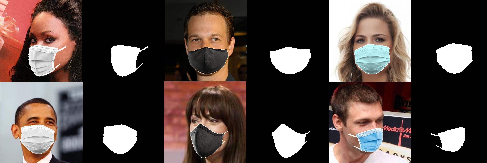
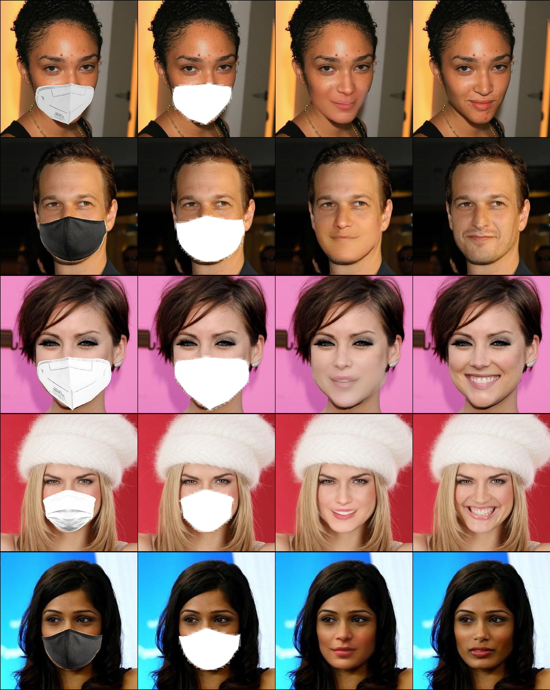
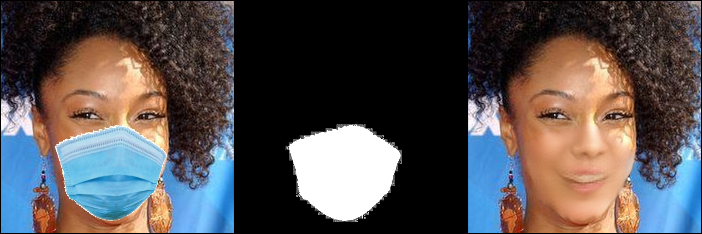
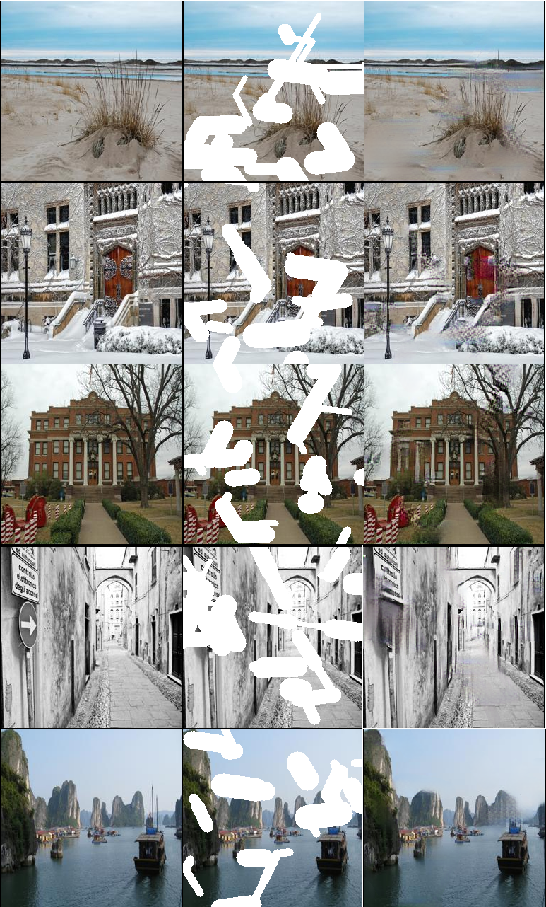
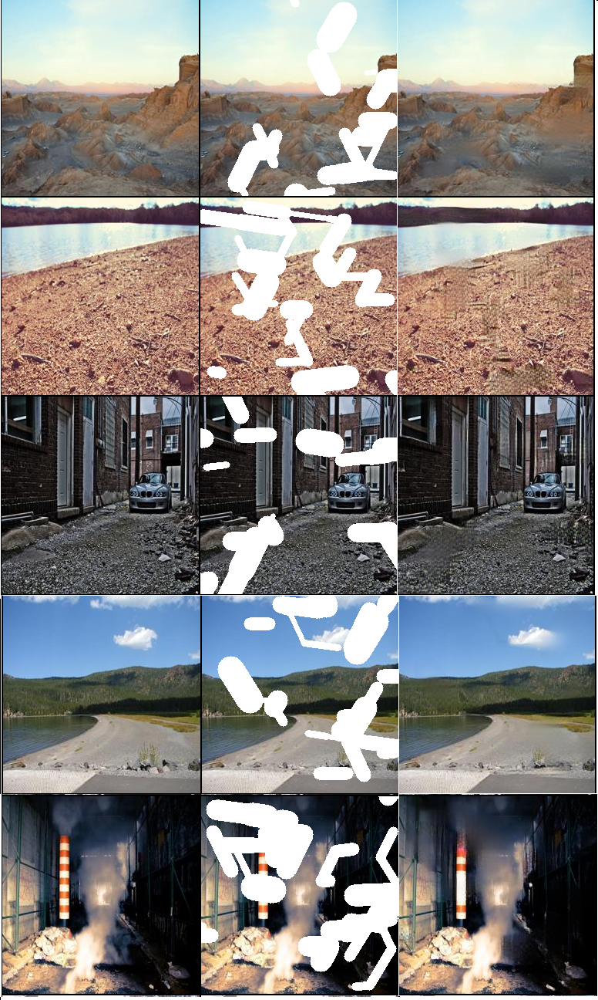

# Inpainting the Masked Face using Gated Convolution + PatchGAN (Pytorch)

## Environments
- Windows 10
- Pytorch 1.6

## CelebA data preparation:

  - Download CelebA dataset then crop the image while keeping ratio with [here](https://github.com/LynnHo/HD-CelebA-Cropper)
  - Create synthesis facemask segmentation dataset on the cropped set with [here](https://github.com/aqeelanwar/MaskTheFace) 
  **(orginal code does not provide binary masks, add it yourself)**
  
  
  
  - Folder structure:
  ```
  this repo
  │   train.py
  │   trainer.py
  │   unet_trainer.py
  │
  └───configs
  │      facemask.yaml
  │      segm.yaml
  │
  └───datasets  
  │   └───celeba
  │       └───images
  │           └───celeba512_30k
  │           └───celeba512_30k_binary
  │           └───celeba512_30k_masked
  │       └───annotations
  │           |  train.csv
  │           |  val.csv
  ```
  - Put unmasked images in ```celeba512_30k```, facemasked images in ```celeba512_30k_masked```, and binary masks in ```celeba512_30k_binary```
  - Split train/validation then save filepaths to .csv. Example:
      ```
      ,img_name,mask_name
      0,celeba512_30k_masked\012653_masked.jpg,celeba512_30k_binary\012653_binary.jpg
      1,celeba512_30k_masked\016162_masked.jpg,celeba512_30k_binary\016162_binary.jpg
      2,celeba512_30k_masked\011913_masked.jpg,celeba512_30k_binary\011913_binary.jpg
      ```
  - Edit configs on both ***segm.yaml*** and ***facemask.yaml***
  - **Follow the same steps above when applying custom dataset**
  
## Training steps:
- Train segmentation model in ***unet_trainer.py***
- Train inpainting model in ***trainer.py***
- Using ***infer.py*** with 2 checkpoints from above tasks to do inference

## Train facemask segmentation

```
python train.py segm --resume=<resume checkpoint>
```

## Train facemask inpainting

```
python train.py facemask --resume=<resume checkpoint>
```

## Results (100,000 iterations with batch size = 2):
| | |
|:-------------------------:|:-------------------------:|
| |  |

<p align="center">
Inpainting results on Masked CelebA-512 (from left to right: FaceMasked - Segmented - Inpainted - Ground Truth)
</p>

| | |
|:-------------------------:|:-------------------------:|
| |  |

<p align="center">
Free-Form Inpainting results on Places365-256 (from left to right: Ground Truth - Masked - Inpainted )
</p>

## Paper References:
- Idea and training process from [A Novel GAN-Based Network for Unmasking of Masked Face](https://ieeexplore.ieee.org/abstract/document/9019697)
- Base model from [Free-Form Image Inpainting with Gated Convolution](https://arxiv.org/abs/1806.03589)

## Code References
- Generator from https://github.com/zhaoyuzhi/deepfillv2
- Discriminator from https://github.com/junyanz/pytorch-CycleGAN-and-pix2pix
- https://github.com/avalonstrel/GatedConvolution_pytorch
- https://github.com/LynnHo/HD-CelebA-Cropper
- https://github.com/aqeelanwar/MaskTheFace
